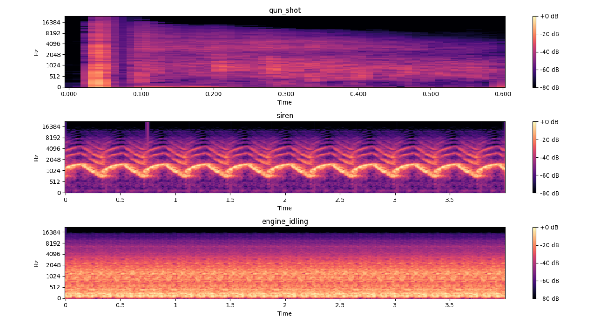
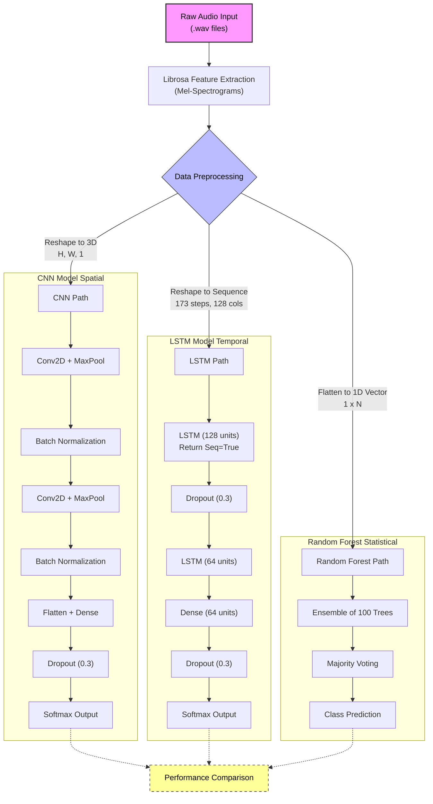
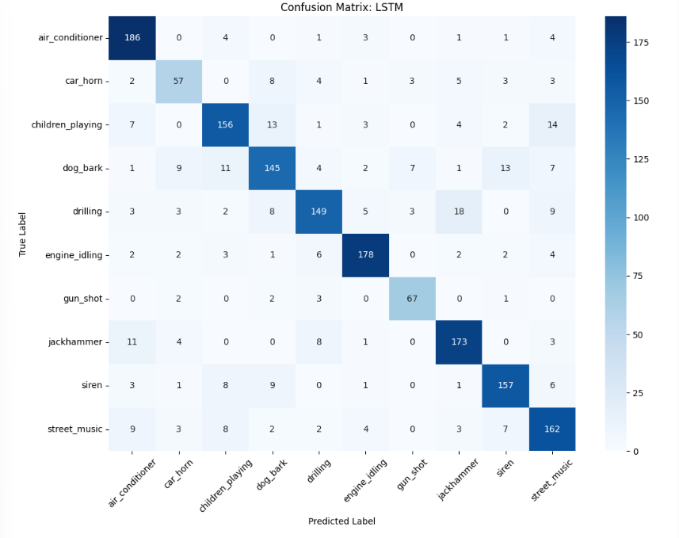

# Urban Audio Intelligence & Noise Classifier

This project implements an intelligent sound recognition system designed to classify urban noises using the **UrbanSound8K** dataset. It leverages digital signal processing (DSP) and deep learning architectures to distinguish between 10 common city sounds.


## Project Overview
The goal of this project is to process raw audio data into visual representations (Mel-Spectrograms) and train various machine learning models to identify environmental sounds. This system can be used for noise pollution monitoring, smart city safety applications, or automated sound indexing.
   
   *Figure 1: Mel-Spectrogram representations of 'Gunshot', 'Siren', and 'Engine Idling'.*

### UrbanSound8K Classes:
* Air Conditioner, Car Horn, Children Playing, Dog Bark, Drilling, Engine Idling, Gun Shot, Jackhammer, Siren, and Street Music.

## Tech Stack
* **Audio Processing:** `librosa`
* **Deep Learning:** `TensorFlow`, `Keras`
* **Machine Learning:** `Scikit-Learn`
* **Data Handling:** `NumPy`, `Pandas`, `h5py`
* **Visualization:** `Matplotlib`, `Seaborn`
* **Concurrency:** `Joblib` (Parallel processing)

---

## Pipeline & Features





### 1. Exploratory Data Analysis (EDA)
* **Class Distribution:** Analyzed the frequency of each audio class to ensure balanced training.
* **Spectrogram Visualization:** Generated class-wise Mel-Spectrograms to visualize the unique "fingerprint" of different urban sounds.

### 2. Preprocessing & Feature Engineering
Since raw audio files vary in length and sample rate, the following steps were implemented:
* **Standardization:** All audio is resampled to 22.05 kHz and normalized to a fixed 4.0-second duration.
* **Feature Extraction:** Raw waveforms are converted into **Mel-Spectrograms** (128 Mel bands).
* **Normalization:** Pixel values are scaled between 0 and 1 using Min-Max scaling.
* **Parallel Processing:** To handle 8,732 audio files efficiently, the preprocessing uses multi-core batch processing.
* **Efficient Storage:** Processed features are stored in an `.h5` file format to minimize I/O overhead during training.

### 3. Model Architectures
The project compares three distinct approaches to determine the most effective classification method:

| Model | Architecture | Best For |
| :--- | :--- | :--- |
| **CNN** | Convolutional Neural Network | Spatial pattern recognition in spectrogram "images." |
| **LSTM** | Long Short-Term Memory | Capturing temporal/sequential dependencies in sound. |
| **Random Forest** | Ensemble Learning | Establishing a statistical baseline with flattened vectors. |

---

## Usage

### Prerequisites
The dataset should be placed in the following directory structure:
```text
/input/urbansound8k/
    ├── UrbanSound8K.csv
    ├── fold1/
    ├── fold2/
    ...
```
## Installation & Setup

1. **Clone the repository:**
   ```bash
   git clone https://github.com/pratyaksha-jha/urban-sound-pollution-classifier.git
   ```
2. **Install Dependencies:**
  ```bash
   pip install numpy pandas matplotlib seaborn tensorflow sklearn librosa h5py joblib tqdm
```
3. **Download Dataset:**
    Place the UrbanSound8K folder in the /input/ directory.

---
##  Execution Steps

To replicate this project, follow these steps in order:

1.  **Data Preparation:** Run the preprocessing cells. This script will utilize parallel processing to convert raw `.wav` files into Mel-spectrograms and store them in `urbansound_data.h5`.
2.  **Model Training:**
    * **CNN:** Best for spatial features.
    * **LSTM:** Best for temporal sequences.
    * **Random Forest:** Best for a fast, non-deep-learning baseline.
3.  **Evaluation:** Call the `evaluate_model()` function. This will automatically generate a confusion matrix and a detailed classification report.

---

## Results & Evaluation
The models are evaluated based on their ability to generalize to unseen "folds" of urban data. We use the following metrics:

* **Accuracy & Loss Curves:** Used to monitor training progress and detect overfitting.
* **Confusion Matrix:** Crucial for this dataset to identify which sounds (e.g., "drilling" vs. "jackhammer") have similar frequency signatures.
* **Classification Report:** Provides detailed **Precision**, **Recall**, and **F1-Score** for every urban class.

  
*Figure 2: Confusion Matrix showing LSTM model performance across all 10 classes.*
## Model Performance Comparison

The table below provides a comparative analysis of the different architectures used in this project. The models were evaluated based on their ability to generalize to unseen data while monitoring for signs of overfitting.

| Model | Training Acc | Test Acc | Precision | Recall |
| :--- | :---: | :---: | :---: | :---: |
| **CNN** | 84.5% | 74.8% | 0.77 | 0.75 |
| **LSTM** | 92.5% | **81.8%** | **0.82** | **0.82** |
| **Random Forest** | **99.0%** | 72.2% | 0.73 | 0.72 |

### Key Takeaways

* **Top Performer:** The **LSTM** model outperformed the others on the test set, achieving the highest accuracy and a balanced F1-score (inferred from high precision/recall).
* **Overfitting:** The **Random Forest** model shows significant overfitting, with a nearly perfect training score but the lowest performance on test data.
* **Stability:** The **CNN** offers a moderate balance but lacks the sequence-processing advantages seen in the LSTM results.

---


---


##  Author

| Detail | Information |
| :--- | :--- |
| **Name** | Pratyaksha Jha |
| **Course** | B.Tech - Data Science and Artificial Intelligence |
| **Institution** | Indian Institute of Technology (IIT), Guwahati |

---
